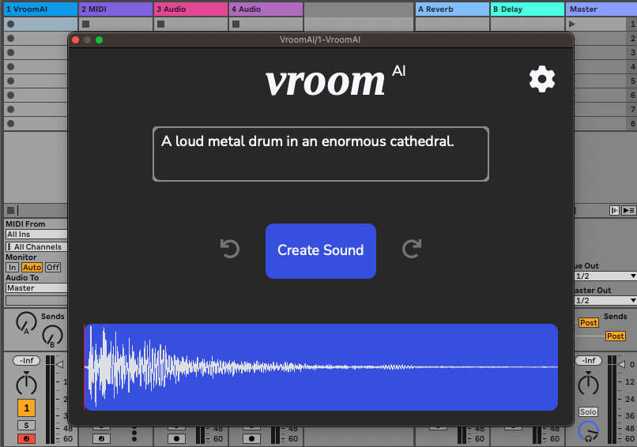

<h1 align="center"; style = font-size: 500px; > VroomAI </h1>

<h3 align="center"> Generate sounds from words. Directly in your DAW. </h3>

 

  

## Summary
In the last few months the field of text-to-audio AI models has [rapidly evolved](https://github.com/archinetai/audio-ai-timeline). VroomAI is a VST plugin delivering the latest text-to-audio AI models directly to artists.

VroomAI was created as a submission to the [2023 Neural Audio Plugin Competition](https://www.theaudioprogrammer.com/neural-audio).

## Usage
Currently the audio samples are saved into a user-specified directory and can additionally be played at various pitches in DAW.

## Available Models
- [AudioLDM (Haohe Liu, Zehua Chen, Yi Yuan, Xinhao Mei, Xubo Liu, Danilo Mandic, Wenwu Wang, Mark D. Plumbley).](https://github.com/haoheliu/AudioLDM)
- *[MusicLM](https://google-research.github.io/seanet/musiclm/examples/) (Internal implementation coming soon)*

## Downloads

- MacOS VST3 Download

## Authors
[Monty Anderson](https://montyanderson.net) ([Prodia Labs](https://prodia.com))

Barney Hill (University of Oxford)
